# Stream Deck Plugin Button Image Reference

This reference includes images of all of the plugin buttons and each of their states.

## Contents

- [Legend](#legend "Symbols, Colors, and Terms")
- [Game Control](#game-control "Game Control Buttons")
- [Jammer Status](#jammer-status "Jammer Status Buttons")
- [Team Timeouts and Reviews](#team-timeouts-and-reviews "Team Timeout And Official Review Buttons")
- [Scoring](#scoring "Scoring Buttons")
- [Clocks](#clocks "Clock Buttons")
- [Pages of Buttons](#pages-of-buttons "Menu Page Buttons")

Buttons for team-specific operations team take a `Team` setting, and appear in the images here in the colors of teams whose CRG `operator` colors are set to white text on a purple background (Team 1), and purple text on a white background (Team 2).  See the [Button Action Reference](../README.md#button-action-reference "Button Image Reference") for what each button does.

## Legend

This section describes the symbols, colors, and terms that appear on the plugin buttons.

  

    <strong>Universal symbols</strong>
  

- **Blue corner tab with an `i`.**  The button displays information only.  Pressing it takes no action.

  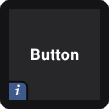

- **Blue corner tab with a chevron.**  Pressing the button opens a page of more buttons.  `Back`, in the top left corner of each page, returns to your layout.

  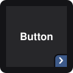

- **Top bar.**  Gray when the state a button controls is off.  Green when the state is on, or its timeout is running.

  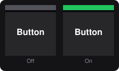

- **Top bar filling during a hold.**  The top bar fills with the color the state changes to.  Releasing the button before the top bar fills cancels the action.

  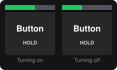

- **Red top bar filling during a hold.**  The hold disconnects the Stream Deck from CRG, or replaces an action that was undone.

  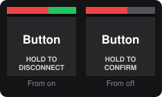

- **Dial.**  Buttons without a top bar show hold progress as a dial in the upper right corner, which fills clockwise.

  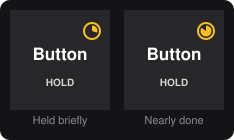

- **`HOLD`, `HOLD TO`.**  Press and hold the button for one second to commit the action.  A quick press takes no action.  On `Lost Lead`, `HOLD` sits in the top bar, and changes color as the bar fills behind it.

  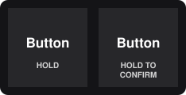

- **Darkened button.**  CRG is not connected, or the button has nothing to act on, such as `Undo` when there is nothing to undo.  Pressing it takes no action.

  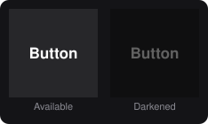

  

    <strong>Symbols and colors on specific buttons</strong>
  

- **Dots.**  `Team Timeout` and `Official Review` display a dot for each one remaining, and an outline for each one used.  An active timeout or review dot pulses until it ends.

  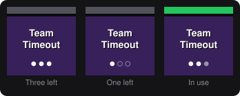

- **Plus sign, line.**  A plus sign indicates a team won its first official review of a period.  A line means the team won its second official review within the same period.

  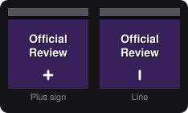

- **Faded title.**  The team has no remaining reviews.

  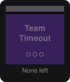

- **Wording over an icon.**  CRG does not accept this button right now, and the wording describes why.  Pressing it takes no action.

  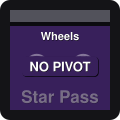

- **Score panels.**  The large panel is the team's total score, and the small panel is the team's points in the current jam.  The Team 1 and Team 2 buttons mirror each other to match the scoreboard.

  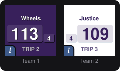

- **`Jam Control` colors.**  Green when a press starts a jam, orange five seconds before a jam should start, dark red when a press stops a jam, and bright red when a press ends a timeout. Red when the period has no time for another jam, and during overtime lineup. Gold five seconds before a jam should start. Pulses when the lineup runs past its time.  When there is no jam to start, such as after the score is final, the button shows a faded `Start Jam` and takes no action.

  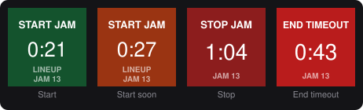

- **`CRG Connection` colors.**  Green when connected, yellow while connecting, red when offline, orange when CRG does not allow the Stream Deck to make changes, and gray when manually disconnected.

  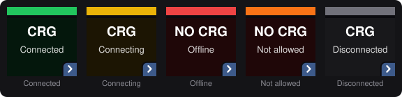

- **Clock activity top bar.**  `Clock` and `Active Clock` buttons show a green top bar while a clock runs, and a gray top bar while it is stopped.

  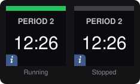

- **Italic name.**  The CRG operator profile whose settings the Stream Deck uses.

  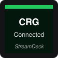

  

    <strong>Terms</strong>
  

| Term | Meaning |
| ---- | ------- |
| `NI` | No initial.  The jammer has not completed their initial trip. |
| `JAM` | The jam number from CRG.  On `Jam Control`, the active jam, or the jam that just ended. |
| `TRIP` | The jammer's current trip number, including the initial trip. |
| `LINEUP` | The lineup clock is running. |
| `POST TIMEOUT` | The post-timeout lineup clock is running. |
| `INTERMISSION` | The pre-game and between periods clock. |
| `COMING UP` | There is no pre-game clock or it has expired. |
| `NO CRG` | The plugin cannot reach CRG, or CRG does not allow the Stream Deck to make changes. |
| `NO PIVOT` | The team has no pivot in the current jam lineup, so CRG does not allow a star pass. |
| `REPLACE` ... `WITH` | On the `Undo` page, the action that was undone, and the buttons that can replace it. |

## Game Control

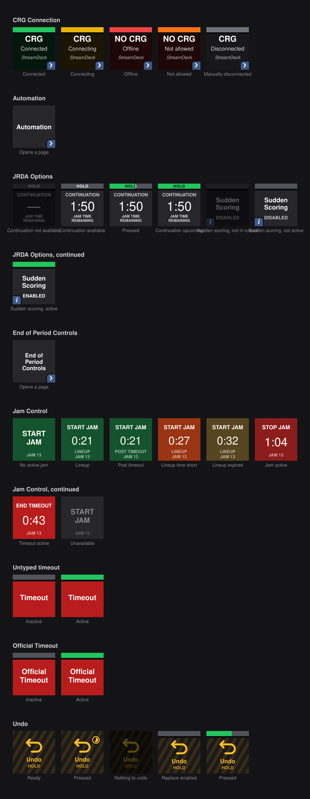

## Jammer Status

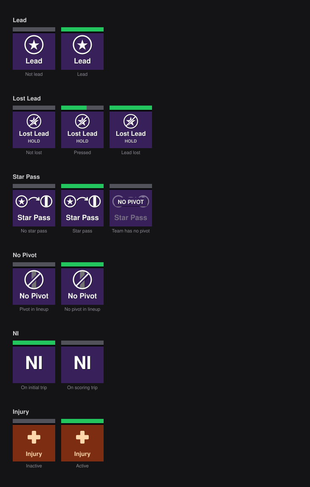

## Team Timeouts and Reviews

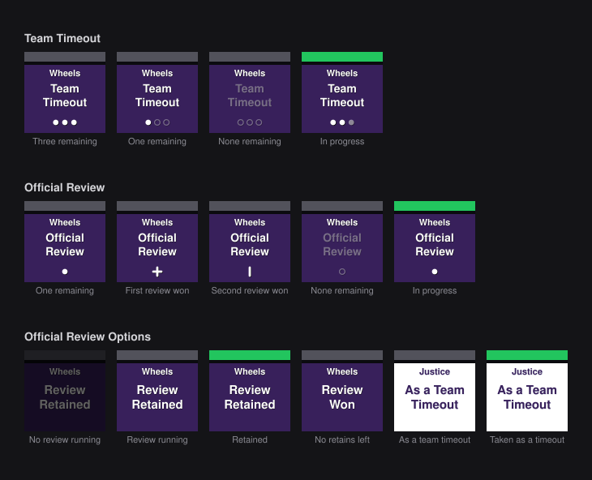

## Scoring

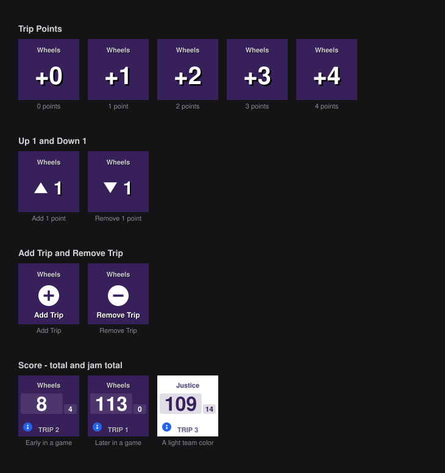

## Clocks

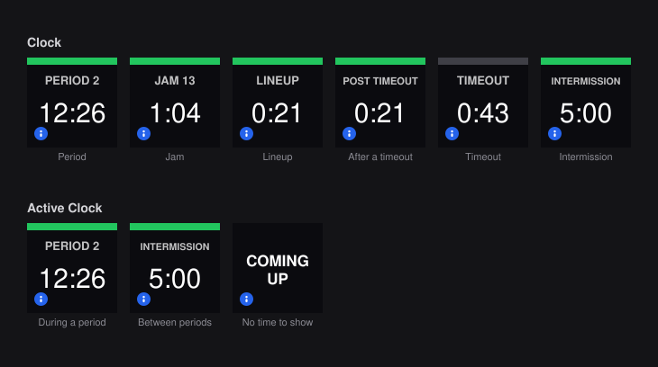

## Pages of Buttons

The plugin switches a Stream Deck to one of these pages when a button opens a menu, and switches back when the menu closes.

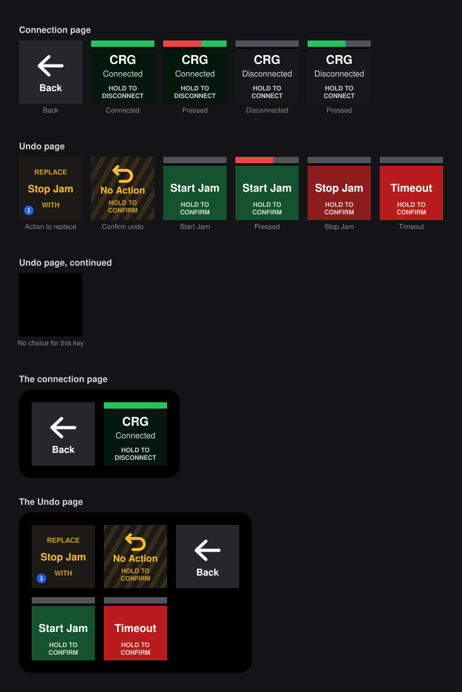
